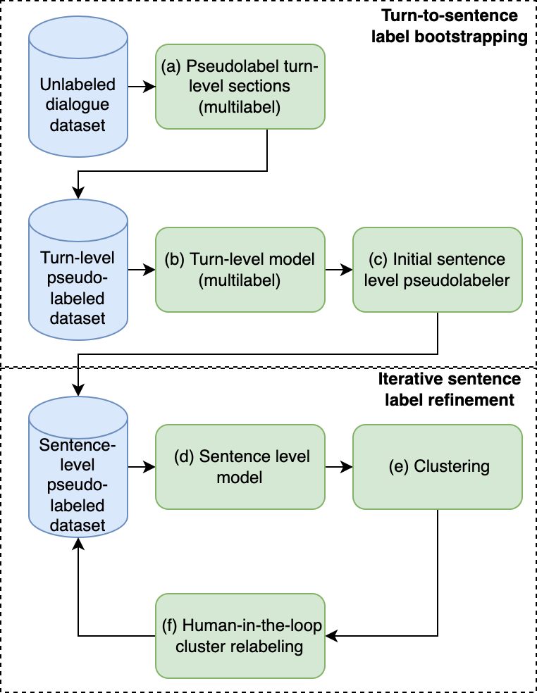

Title: Learning functional sections in medical conversations: iterative pseudo-labeling and human-in-the-loop approach

Authors: Mengqian Wang, Ilya Valmianski, Xavier Amatriain and Anitha Kannan

Abstract: Medical conversations between patients and \doctors~have implicit functional sections, such as "history taking", "summarization", "education",  and "care plan." In this work, we are interested in learning to automatically extract these sections. A direct approach would require collecting large amounts of expert annotations for this task, which is inherently costly due to the contextual inter-and-intra variability between these sections. This paper presents an approach that tackles the problem of learning to classify medical dialogue into functional sections without requiring a large number of annotations. Our approach combines pseudo-labeling and human-in-the-loop. First, we bootstrap using weak supervision with pseudo-labeling to generate dialogue turn-level pseudo-labels and train a transformer-based model, which is then applied to individual sentences to create noisy sentence-level labels. Second, we iteratively refine sentence-level labels using a cluster-based human-in-the-loop approach. Each iteration requires only a few dozen annotator decisions. We evaluate the results on an expert-annotated dataset of 100 dialogues and find that starting with the accuracy of 69.5%, our iterative refinement approach is able to boost accuracy to 82.5%.

### Experiments

Our model is featured by iterative pseudo-label refinement and training. This pseudolabeling operates in two steps (see figure below for schematics)

#### Turn-to-sentence label bootstrapping:

task-specific heuristics to create turn-level pseudolabels and train a turn-level model, which is then applied to create sentence-level pseudolabels.

#### Iterative sentence label refinemen:

Train a sentence-level model, cluster the sentence-level model representations conditioned on the predicted label, and then use a oracle to relabel each cluster based on its purity.

The design of the pseudo-labeling heuristics is specific to the dataset. Since the data is not being shared, we skipped the actual pseudo-label details in here. Clustering and human-in-the-loop annotation are the crucial part in both turn-level and sentence-level pseudo-labeling. We included the process in a jupyter notebook which allows an interactive interface.

### Description on Code Usage

train_turn.sh and test_turn.sh allow training and testing on the turn-level data. Your training and testing data should be in pandas dataframes and wrapped in .pkl files. The data directory is set to be "datasets/" as default. You should name your training data as "train_turn.pkl" and testing data as "test_turn.pkl" and put them under "datasets/". Your data should have columsn of:
- text: the dialogue turn
- columns of binary labels

train_sent.sh and test_sent.sh are for training and testing on the sentence-level. Your training and testing data should be in pandas dataframes and wrapped in .pkl files. The data directory is set to be "datasets/" as default. You should name your training data as "train_sent.pkl" and testing data as "test_sent.pkl" and put them under "datasets/". Your data should have columsn of:
- text: the sentence
- columns of binary labels

clustering_turn.ipynb is a jupyter notebook designed for interative clustering and labeling on the turn-level. It was using the pre-trained DeCLUTR embeddings.

clustering_sentence_iterative.ipynb is a jupyter notebook designed for interative clustering and labeling on the sentence-level. Every time we finish an interation of model training, we use the model to generate a set of embeddings and do the clustering. The pseudo-labels will be updated based on the human labels of the clusters.

