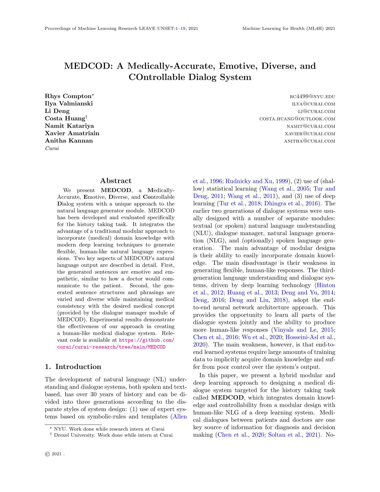
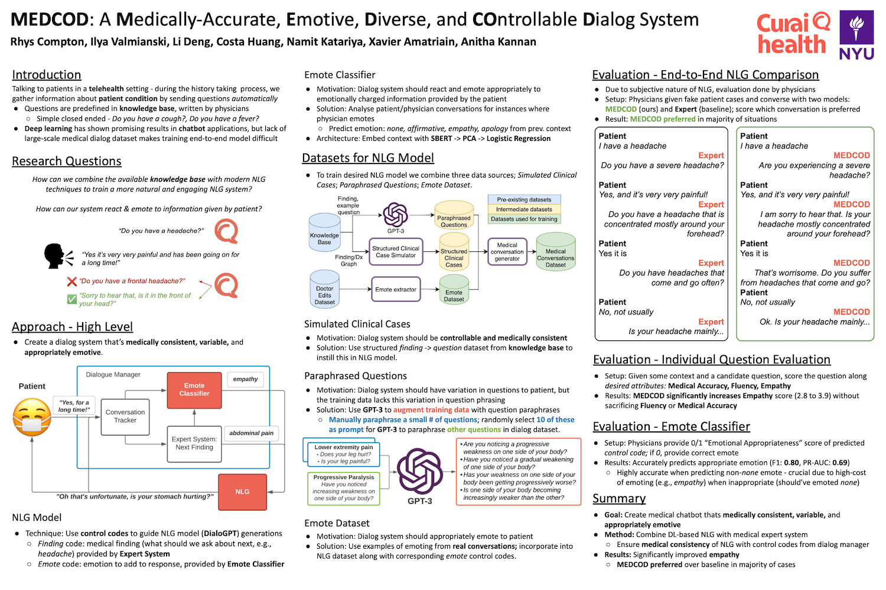

# **MEDCOD**: A **M**edically-Accurate, **E**motive, **D**iverse, and **CO**ntrollable **D**ialog System


This repository contains the models/algorithms described in: 

[Rhys Compton](https://www.rhyscompton.co.nz/), [Ilya Valmianski](#), [Li Deng](#), [Costa Huang](#), [Namit Katariya](#), [Xavier Amatriain](#), [Anitha Kannan](#) - *MEDCOD: A Medically-Accurate, Emotive, Diverse, and Controllable Dialog System*, in [ML4H 2021](https://ml4health.github.io/2021/).

### ArXiv Preprint - [Link](https://arxiv.org/abs/2111.09381)



### Conference Poster - [Link](https://drive.google.com/file/d/1KbWS2PQZ9M6fkDZoleH1ehmWA7Ui0i0M/view?usp=sharing)



Table of Contents
=================
- [Requirements](#requirements)
- [Usage Instructions](#usage-instructions)
- [Results](#results)

## Requirements

To install requirements:

```setup
pip install -r requirements.txt
```

## Usage Instructions

Watch this space...

## Results

