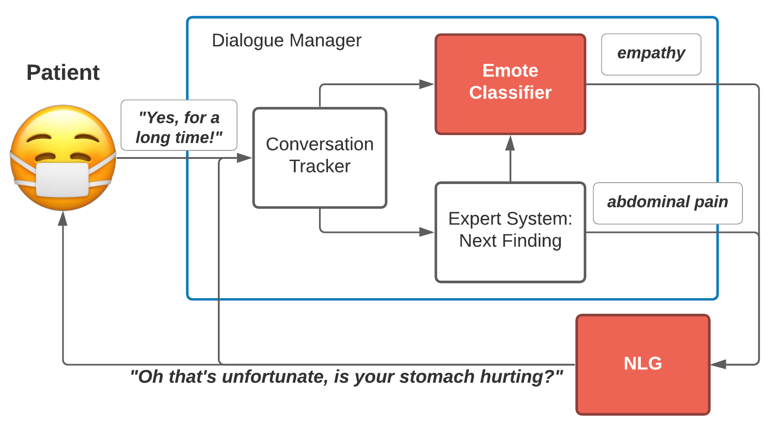

# [MEDCOD: A Medically-Accurate, Emotive, Diverse, and Controllable Dialog System](https://arxiv.org/abs/2111.09381)

Authors: [Rhys Compton](https://www.rhyscompton.co.nz/), [Ilya Valmianski](http://ilya.valmianski.com), [Li Deng](https://www.linkedin.com/in/lideng/), [Costa Huang](https://costa.sh), [Namit Katariya](https://www.linkedin.com/in/namitkatariya), [Xavier Amatriain](https://xamat.github.io), [Anitha Kannan](https://www.linkedin.com/in/anitha-kannan-ak/)



> We present MEDCOD, a Medically-Accurate, Emotive, Diverse, and Controllable Dialog system with a unique approach to the natural language generator module. MEDCOD has been developed and evaluated specifically for the history taking task. It integrates the advantage of a traditional modular approach to incorporate (medical) domain knowledge with modern deep learning techniques to generate flexible, human-like natural language expressions. Two key aspects of MEDCOD's natural language output are described in detail. First, the generated sentences are emotive and empathetic, similar to how a doctor would communicate to the patient. Second, the generated sentence structures and phrasings are varied and diverse while maintaining medical consistency with the desired medical concept (provided by the dialogue manager module of MEDCOD). Experimental results demonstrate the effectiveness of our approach in creating a human-like medical dialogue system. Relevant code is available at this https URL

## Conference Poster 

[](https://drive.google.com/file/d/1VwW8kcg2dDvkUahTFwSg4NXdDgoXEbLN/view?usp=sharing)

## Setup

All code in this repo operates off the same virtual environment. Follow the steps below to set it up.

```
pyenv virtualenv dialogpt
pyenv local dialogpt
pip install -r requirements.txt
```


## Contents

* `0-gpt3_paraphrasing` - Scripts for paraphrasing KB questions using **GPT-3** and analysing the results
* `1-dialogpt` - All code related to data preparation and training of **DialoGPT**
* `2-dr_edits` - Code for preprocessing the Dr Edits dataset, and for training the **Empathy Prediction** model

Please see each individual folder for more details
